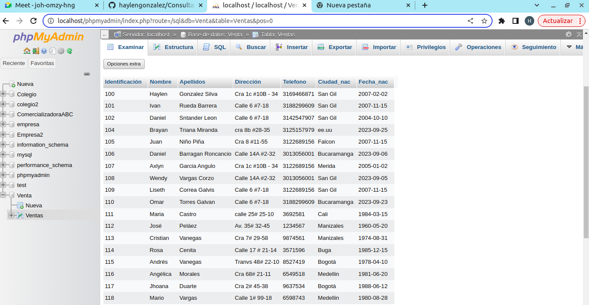
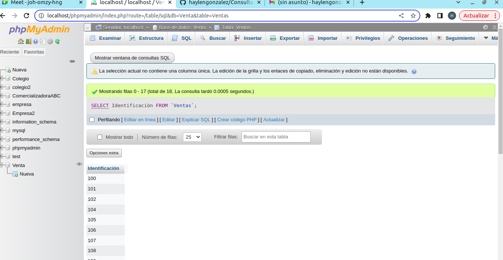
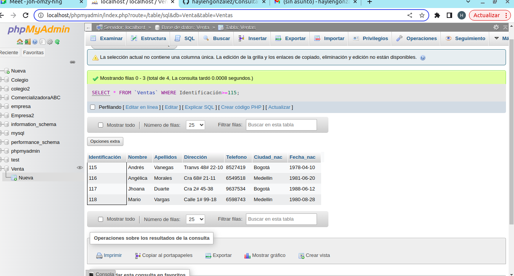
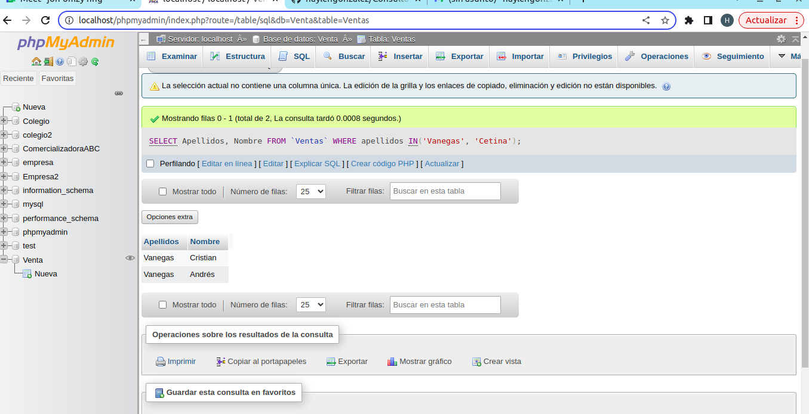
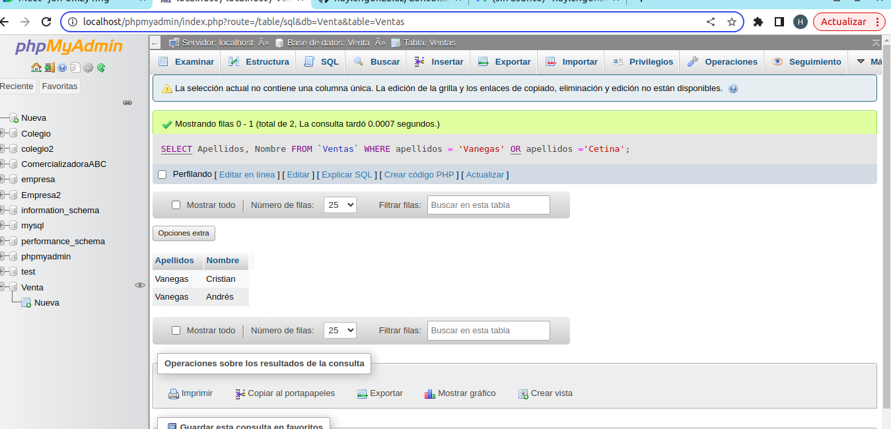
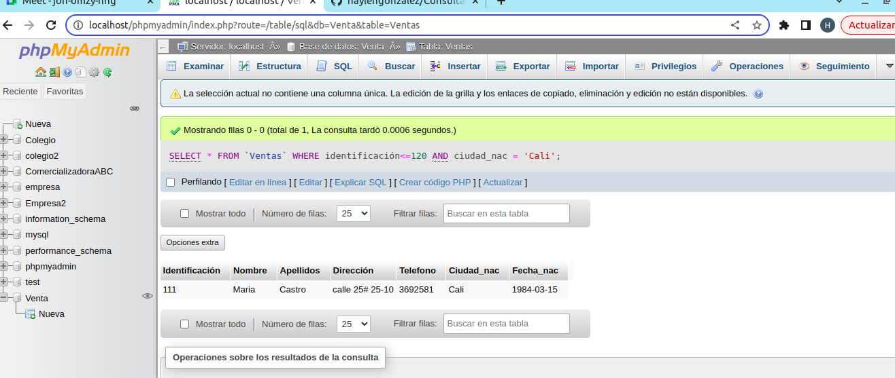

## consultas_1_sql
# Introducción a las consultas a una BD usando el lenguaje SQL

## Base de datos. Ventas
## Tabla : Cliente

## Instruccion SELECT 
- permite seleccionar datos de una tabla.!
` SELECT campos_tabla FROM nombre_tabla`

### consulta NO. 1
1. para visualizar toda la informacion que contiene la tabla ciente se puede incluir con la intruccion SELEC el caracter **\*** o cada uno de los campos de la tabla.

- `SELEC * FROM Cliente`

- `SELECT identificacion, nombre, apellidos, dirrecion, telefono, ciudad_nac, fecha_nac FROM Cliente`

### Consulta No. 2

2. para viasualizar solamente la identificacion del cliente: `SELECT identificación FROM Cliente`

### Consulta No.3

3. Si se desea obtener los registros cuya identificación sea mayor o igual a 150, se de utilizar la cláusula `WHERE` que especifica las condiciones que deben reunir los registros que se van a seleccionar: `SELEC * FROM Cliente WHERE identificacion>=150`

### Consulta No.4

4. Se desea obtener los registos cuyos apellidos sean Vanegas o Cetina, se debe utilizar el operador `IN` que especifica los registros que se quieren visualizar de una tabla.

`SELECT apellidos FROM Cliente WHERE apellidos IN('Vanegas', 'Cetina')`

O se puede utilizar el operador `DR`

`SELECT apellidos, nombre FROM Cliente WHERE apellidos = 'Vanegas' OR apellidos ='Cetina'`

### Consulta No.5

5. Se desea obtener los registros cuyta identificación sea menor de 110 y la ciudad sea Cali, se debe utilizar el operador  `AND`
`SELECT * FROM Cliente WHERE identificación<=110 AND ciudad_nac = 'Cali'`

### Consulta No.6

6. Cómo se crea una relación uno o muchos en phpMyAdmin